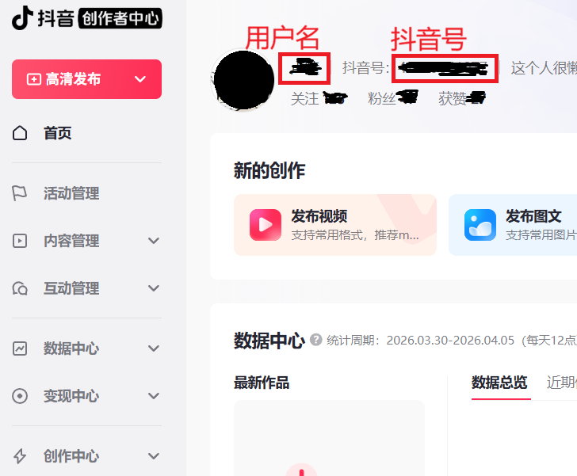
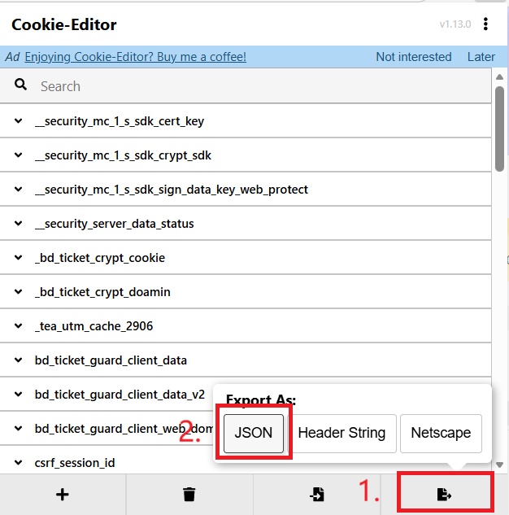
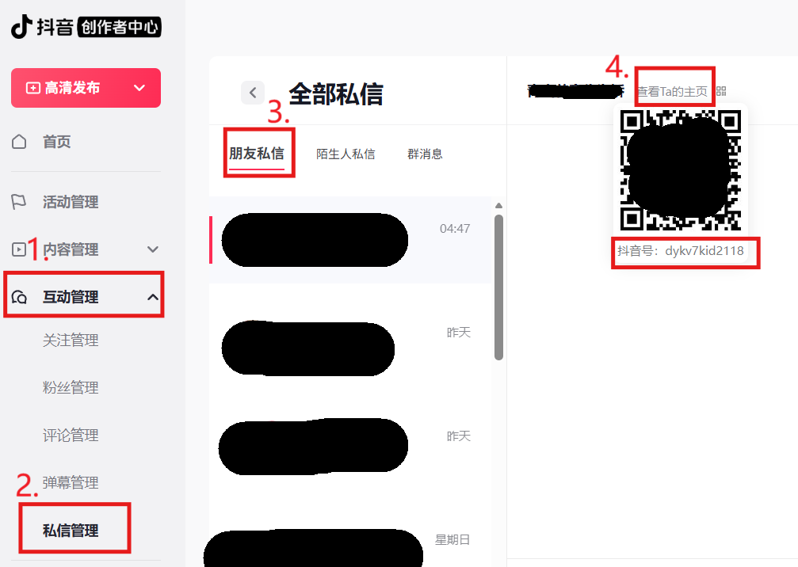

# DouYinSparkFlow 配置生成器

## 1. 配置生成器介绍

编辑器网址：[https://oilu.cn/DouYinSparkFlow](https://oilu.cn/DouYinSparkFlow)

这个可视化在线编辑器的作用是：填写配置信息后，自动生成可用于环境变量的配置内容。生成后可直接复制到 GitHub Secrets（环境变量）中使用，减少手动整理和配置出错。

**问：安全吗？**

答：该工具本质上是托管在本仓库 GitHub Pages 上的单页网页应用，相关源码已在 docs 目录开源，可自行查看与审计。此外，当前展示的网址不是 GitHub Pages 默认域名，是因为我的 GitHub Pages 博客绑定了自定义域名，因此可以直接通过该域名访问；同时该域名接入了腾讯云 CDN，访问速度会更快。

**问：为什么不再使用之前的本地 Python 脚本？**

答：在线编辑方式更轻量，无需配置本地环境，也无需拉取代码即可使用。

**问：为什么需要手动获取 Cookies？**

答：在线网页无法直接读取您电脑或浏览器中的本地数据。若改为远程服务端方案，不仅部署与维护复杂度更高，还需要在远程设备上登录账号。当前采用手动获取并填写的方式，可尽量保证数据在本地处理且不保存以此保障您的数据安全。

**问：配置生成器填写信息后需要保存之类操作吗？**

答：不需要。配置生成器会实时生成结果，填写完成后无需额外保存或提交，直接复制左侧生成的配置即可使用。

## 2. 配置参数说明

|名称|作用解释|期望值|获取方法|
|-----|-----|-----|-----|
|代理地址（暂未实现）|-|-|-|
|消息模板|发送消息的模板，可以从抖音聊天框编辑好后直接复制过来，这样可以拿到简单表情的代码，例如`[盖瑞]`|使用`[API]`引用每日一言内容 默认值为： `[盖瑞]今日火花[加一]\n—— [右边] 每日一言 [左边] ——\n[API]`|按需编写|
|一言类型|每日一言消息允许的类型|全部可选类型的列表为：`["动画","漫画","游戏","文学","原创","来自网络","影视","诗词","哲学","抖机灵","其他"]`|按需勾选|
|账号匹配模式|设置目标好友的账号匹配模式|昵称（nickname）和抖音号（short_id）|按需设置|
|浏览器操作最长等待时间|默认即可，自建服务器部署根据网络情况调整|数字类型，单位毫秒|基本无需更改|
|好友列表等待时间|默认即可，自建服务器部署根据网络情况调整|数字类型，单位毫秒|基本无需更改|
|任务重试次数|默认即可，自建服务器部署根据网络情况调整|数字类型，单位次|基本无需更改|
|输出日志级别|Error<Warning<Info<Debug，越小打印输出日志越少|Error、Warning、Info、Debug|默认为Info,建议根据需要更改为Debug获取更多调试信息|
|用户名|当前任务账号的用户名仅用作标识|字符串|[抖音创作者中心](https://creator.douyin.com/)获取|
|抖音号|当前任务账号的抖音号|根据账户页面填写|[抖音创作者中心](https://creator.douyin.com/)获取|
|Cookies|当前任务账号的Cookies|根据账户页面填写，需要导出为json|登录[抖音创作者中心](https://creator.douyin.com/)后，使用[Cookie-Editor](https://cookie-editor.com/)浏览器扩展获取|
|好友昵称（回车）|需要发送消息的好友昵称，输入回车添加，可添加多个|填写原始昵称【不能是备注】|[抖音创作者中心](https://creator.douyin.com/)后，互动管理->私信管理获取|

## 3.`用户名`和`抖音号`获取

先使用目标账号登录[抖音创作者中心](https://creator.douyin.com/)，按照下图所示位置即可查找这两个参数。

## 4.`Cookies` 获取

cookies的获取需要借助于[Cookie-Editor](https://cookie-editor.com/)浏览器扩展，提前根据自己浏览器环境安装好此浏览器扩展

使用目标账号登录[抖音创作者中心](https://creator.douyin.com/)，登录成功后保持当前抖音创作者中心页面，打开`Cookie-Editor`，按照下图所示导出Json格式的Cookies

## 5. `目标好友`获取

目标好友是配置当前账户要续火花的对象，可以多个，每添加一个需要回车一次，直到添加完所有续火花对象。

### 使用好友昵称

**前提：** 账号匹配模式选择`昵称`

这里目前只支持填写好友的原始昵称。可按照下面的方式在抖音创作者中心获取。

操作步骤：先使用目标账号登录[抖音创作者中心](https://creator.douyin.com/)，按照下图所示，选择`互动管理->私信管理->朋友私信`在显示的页面下找到对方的昵称即可。

### 使用好友抖音号

> 该模式是为了解决好友更换昵称后无法锁定的问题，目前仍在测试欢迎反馈

**前提：** 账号匹配模式选择`抖音号`

抖音号可以直接打开抖音app，查看好友的主页。也可以直接在抖音创作者中心获取。

操作步骤：先使用目标账号登录[抖音创作者中心](https://creator.douyin.com/)，按照下图所示，选择`互动管理->私信管理->朋友私信`，找到对方后点开与对方的聊天页面，鼠标放在最上方小字`查看Ta的主页`上，就会出现抖音号。

